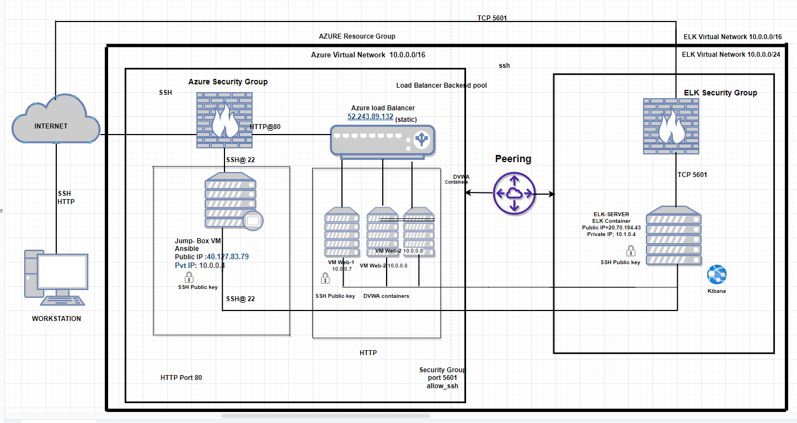

# wiklG01-Monash_Bootcamp_Project1
Project_1
# Project-1
## Automated ELK Stack Deployment
The files in this repository were used to configure the network depicted below.
These files have been tested and used to generate a live ELK deployment on Azure. They can be used to either recreate the entire deployment pictured above. Alternatively, select portions of the YAML file may be used to install only certain pieces of it, such as Filebeat.
  - _TODO: Enter the playbook file.
  - install_elk.yml
This document contains the following details:
- Description of the Topology
- Access Policies
- ELK Configuration
  - Beats in Use
  - Machines Being Monitored
- How to Use the Ansible Build
### Description of the Topology
The main purpose of this network is to expose a load-balanced and monitored instance of DVWA, the D*mn Vulnerable Web Application.
Load balancing ensures that the application will be highly AVAILABLE, in addition to restricting ACCESS to the network.
- _TODO: What aspect of security do load balancers protect?
- LOAD BALANCERS PROTECT AGAINST DENIAL OF SERVICE
-
-   What is the advantage of a jump box?
- Ans: JumpBox is used for the following: automation, security, Network segmentation, as well as Network Access control 
- 
Integrating an ELK server allows users to easily monitor the vulnerable VMs for changes to the DATA and system LOGS.
- _TODO: What does Filebeat watch for?
- Ans: Fielbeat monitors the log files or locations that you specify, collect log events, and forward them either to Elasticsearch or logstash.
- _TODO: What does Metricbeat record?
Ans: Log files and Collect metrics from your systems and services

- METRICS
The configuration details of each machine may be found below.
_Note: Use the [Markdown Table Generator](http://www.tablesgenerator.com/markdown_tables) to add/remove values from the table_.
|  Name       	  |  Function  	|  IP Address(private) 	|  Operating System |
|-----------------|------------	|-----------------------|-------------------|
| Jump Box   	      | Gateway    	| 10.0.0.4    	      | Linux           |
| Web-1      	      | Webserver  	| 10.0.0.7   		      | Linux           |
| Web-2      	      | Webserver  	| 10.0.0.6   	    	  | Linux           |
| Web-3      	      | Webserver  	| 10.0.0.8   		      | Linux           |
| Elk Server 	      | Monitoring 	| 10.1.0.4    	      | Linux           |
| Load Balancer(LB) | LB          | Static External IP  | Linux           |  
| Workstation       | Access cont.| Public IP           | Linux           |

- Folow this step below to create a Load Balacer for web1, web2, and web3
   i. Create a Load Balancer
   ii. Create LB network with conjunction of the main network
   iii. Create the Virtual Machines Web1, Web2, and Web3 with availability for Web2 and Web3.
   iv. Create LB Backend Pool and Add Web1, Web2 and Web3 virtual machines
   v. Create LB rules 
   
### Access Policies
The machines on the internal network are not exposed to the public Internet.
Only the JUMPBOX machine can accept connections from the Internet. Access to this machine is only allowed from the following IP addresses:
- TODO: 5061 Kibana
-
Machines within the network can only be accessed by JUMP BOX PROVISIONER.
- _TODO: Which machine did you allow to access your ELK VM? What was its IP address?
- MY IP ADDRESS 14.2.52.254

A summary of the access policies in place can be found in the table below.
|  Name    	|  Publicly Accessible 	|  Allowed IP Addresses(public) 	|
|----------	|----------------------	|-----------------------	|
| Jump Box 	| Yes          	        | 40.127.83.79       	    |
| Web-1    	| No                   	| 52.147.49.4             |
| Web-2    	| No                   	| 52.147.49.4             |
| Web-3    	| No                   	| 52.147.49.4             |
| Elk      	| No                   	| 20.70.194.43            |
### Elk Configuration
Ansible was used to automate configuration of the ELK machine. No configuration was performed manually, which is advantageous because...
- _TODO: What is the main advantage of automating configuration with Ansible?_
- Ansible is a powerful tool that allows modelling of complex IT workflows.

The playbook implements the following tasks:
- _TODO: In 3-5 bullets, explain the steps of the ELK installation play. E.g., install Docker; download image; etc._
- Install docker.io
- Install docker python module
- Install and launch a docker

The following screenshot displays the result of running `Diagram/Final diagram_project.PNG` after successfully configuring the ELK instance.

### Target Machines & Beats
This ELK server is configured to monitor the following machines:
- _TODO: List the IP addresses of the machines you are monitoring_
- Private IPs of Web-1 and Web-2
-
| Name   	| IP Address 	|
|--------	|------------	|
| Web-1  	| 10.0.0.7  	|
| Web-2  	| 10.0.0.6 	|
We have installed the following Beats on these machines:
- _TODO: Specify which Beats you successfully installed
- FILBEAT
- METRICBEAT
These Beats allow us to collect the following information from each machine:

- _TODO: In 1-2 sentences, explain what kind of data each beat collects, and provide 1 example of what you expect to see. E.g., `Winlogbeat` collects Windows logs, which we use to track user logon events, etc.
- Filebeat collects log files/events
- Metricbeat collects system and metrics information

### Using the Playbook
In order to use the playbook, you will need to have an Ansible control node already configured. Assuming you have such a control node provisioned:
SSH into the control node and follow the steps below:
- Copy the _____ file to _____.
- Update the _____ file to include...
- Run the playbook, and navigate to ____ to check that the installation worked as expected.
_TODO: Answer the following questions to fill in the blanks:_
- _Which file is the playbook? Where do you copy it?_
- _Which file do you update to make Ansible run the playbook on a specific machine? How do I specify which machine to install the ELK server on versus which to install Filebeat on?_
- _Which URL do you navigate to in order to check that the ELK server is running?
_As a **Bonus**, provide the specific commands the user will need to run to download the playbook, update the files, etc._

